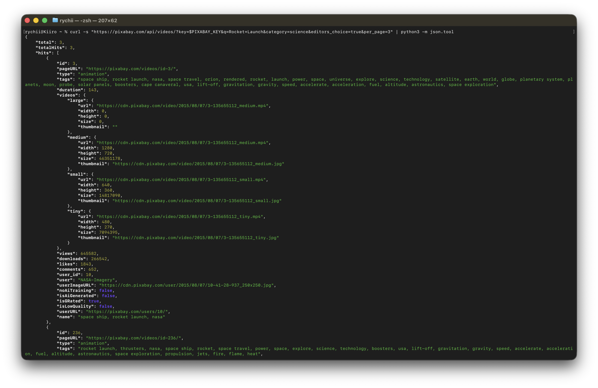
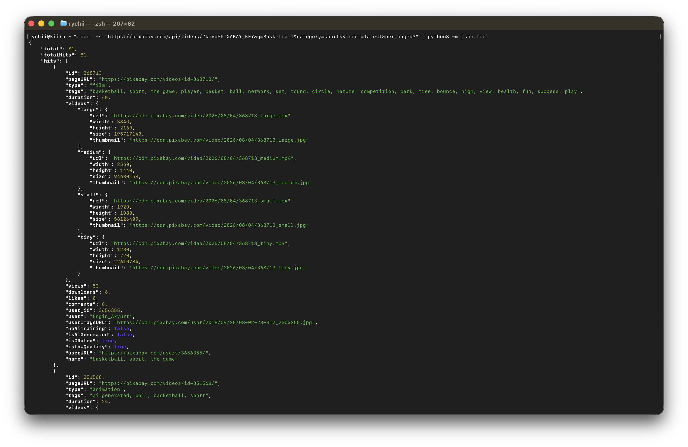
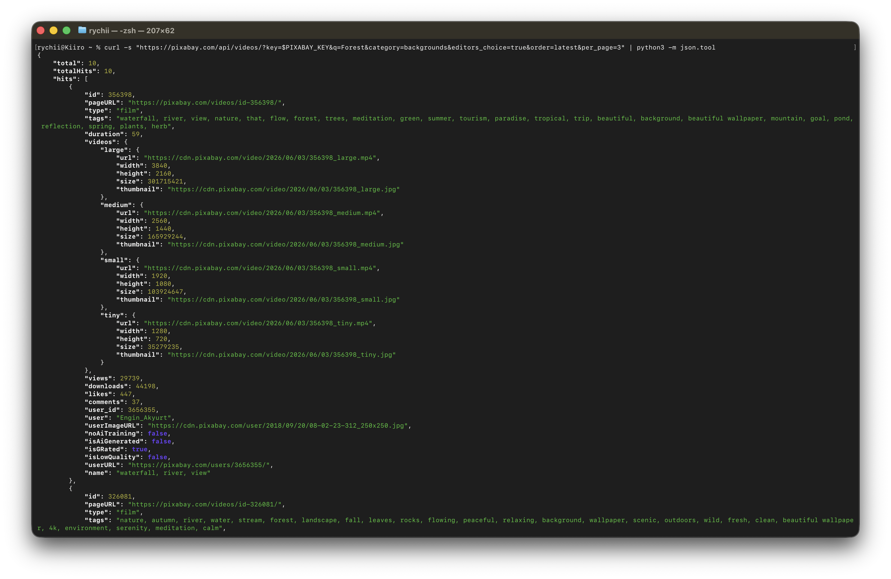
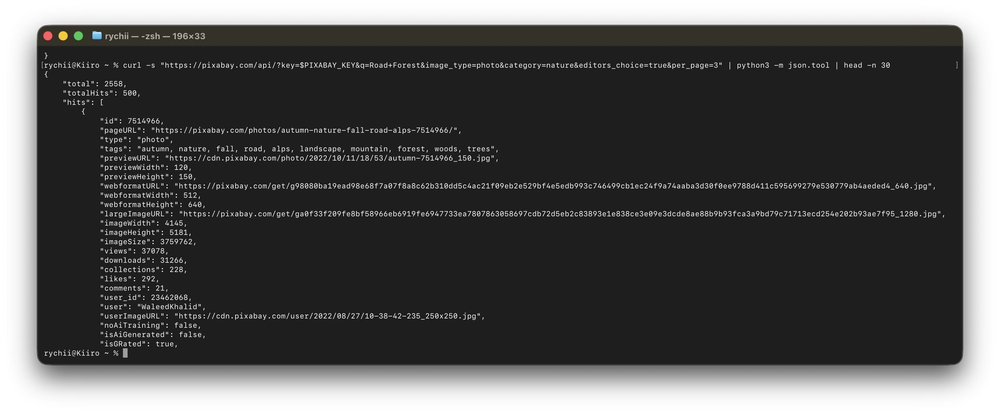

# Pixabay API Practice Lab

> **Note:** My personal Pixabay API key has been hidden for security purposes by setting a temporary variable named PIXABAY_KEY

---

## Challenge 1: Rocket Launch (Video)

### Request URL & CURL Command

```bash
curl "https://pixabay.com/api/videos/?key=$PIXABAY_KEY&q=Rocket+Launch&category=science&editors_choice=true&per_page=3"
```

### API Response



---

## Challenge 2: Basketball (Video)

### Request URL & CURL Command

```bash
curl "https://pixabay.com/api/videos/?key=$PIXABAY_KEY&q=Basketball&category=sports&order=latest&per_page=3"
```

### API Response



---

## Challenge 3: Forest (Video)

### Query Parameters

| Parameter | Value |
| --- | --- |
| `key` | `[REDACTED]` |
| `q` | `Forest` |
| `category` | `backgrounds` |
| `editors_choice` | `true` |
| `order` | `latest` |
| `per_page` | `3` |

### CURL Command

```bash
curl "https://pixabay.com/api/videos/?key=$PIXABAY_KEY&q=Forest&category=backgrounds&editors_choice=true&order=latest&per_page=3"
```

### API Response



---

## Challenge 4: Road Forest (Photo)

### Request URL & CURL Command

```bash
curl "https://pixabay.com/api/?key=$PIXABAY_KEY&q=Road+Forest&image_type=photo&category=nature&editors_choice=true&per_page=3"
```

### API Response

The screenshot below shows the first 30 lines of the JSON response.



---

